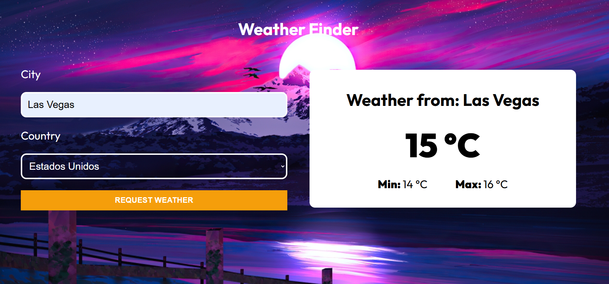

# Weather Finder

This project is a simple simulation that allows you to retrieve weather information for specific countries. You can interact with different cities within selected countries using the OpenWeather API.

## Project Setup

The project was created using Vite with the following configuration:

Configuration
```bash
npm create vite@latest
√ Project name: ... weather-react-typescript
√ Select a framework: » React
√ Select a variant: » TypeScript + SWC
```

# Site Deploy by Netlify

```bash
https://iridescent-scone-22eb1d.netlify.app/
```

## Screenshots

### Main Screen


### Topics
<ul>
  <li>CSS Modules</li>
  <li>API's
    <ul>
      <li>Castear el type</li>
      <li>Type Guards</li>
      <li>ZOD</li>
      <li>Valibot</li>
    </ul>
  </li>
</ul>


## Package to use in this project

```bash
npm i axios
npm i zod --> To manage the API Response
npm i valibot --> To manage the API Response
```

### API Open Weather
```bash
https://home.openweathermap.org/
```

### Environment Variables
```
https://vite.dev/guide/env-and-mode
```

### SpinKit
```
https://tobiasahlin.com/spinkit/
```


# React + TypeScript + Vite

This template provides a minimal setup to get React working in Vite with HMR and some ESLint rules.

Currently, two official plugins are available:

- [@vitejs/plugin-react](https://github.com/vitejs/vite-plugin-react/blob/main/packages/plugin-react/README.md) uses [Babel](https://babeljs.io/) for Fast Refresh
- [@vitejs/plugin-react-swc](https://github.com/vitejs/vite-plugin-react-swc) uses [SWC](https://swc.rs/) for Fast Refresh

## Expanding the ESLint configuration

If you are developing a production application, we recommend updating the configuration to enable type aware lint rules:

- Configure the top-level `parserOptions` property like this:

```js
export default tseslint.config({
  languageOptions: {
    // other options...
    parserOptions: {
      project: ['./tsconfig.node.json', './tsconfig.app.json'],
      tsconfigRootDir: import.meta.dirname,
    },
  },
})
```

- Replace `tseslint.configs.recommended` to `tseslint.configs.recommendedTypeChecked` or `tseslint.configs.strictTypeChecked`
- Optionally add `...tseslint.configs.stylisticTypeChecked`
- Install [eslint-plugin-react](https://github.com/jsx-eslint/eslint-plugin-react) and update the config:

```js
// eslint.config.js
import react from 'eslint-plugin-react'

export default tseslint.config({
  // Set the react version
  settings: { react: { version: '18.3' } },
  plugins: {
    // Add the react plugin
    react,
  },
  rules: {
    // other rules...
    // Enable its recommended rules
    ...react.configs.recommended.rules,
    ...react.configs['jsx-runtime'].rules,
  },
})
```
